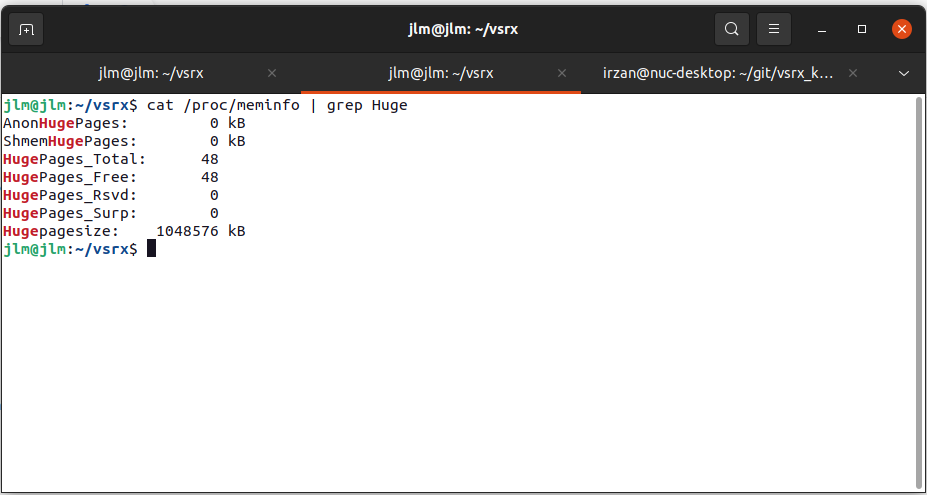
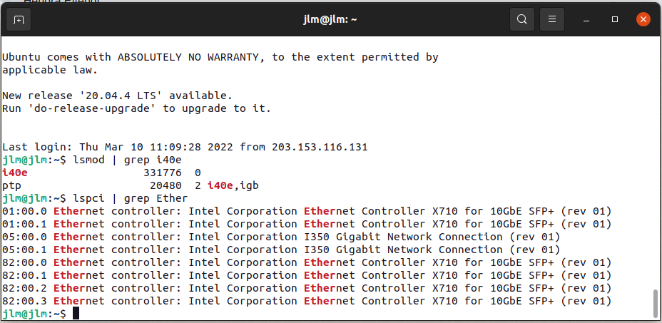
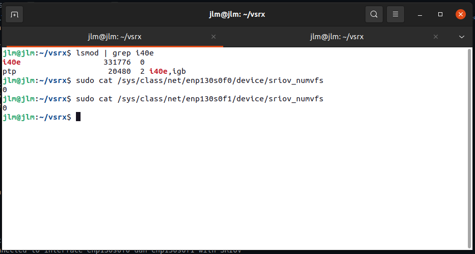
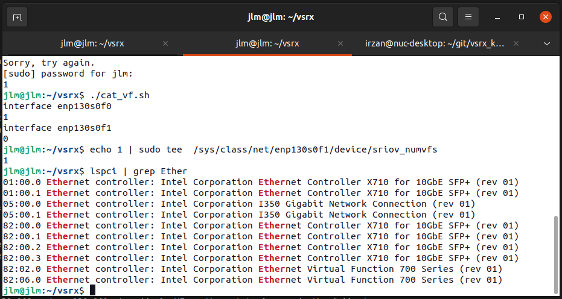
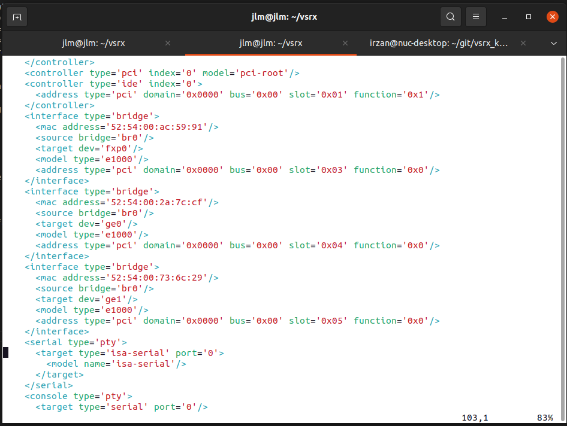
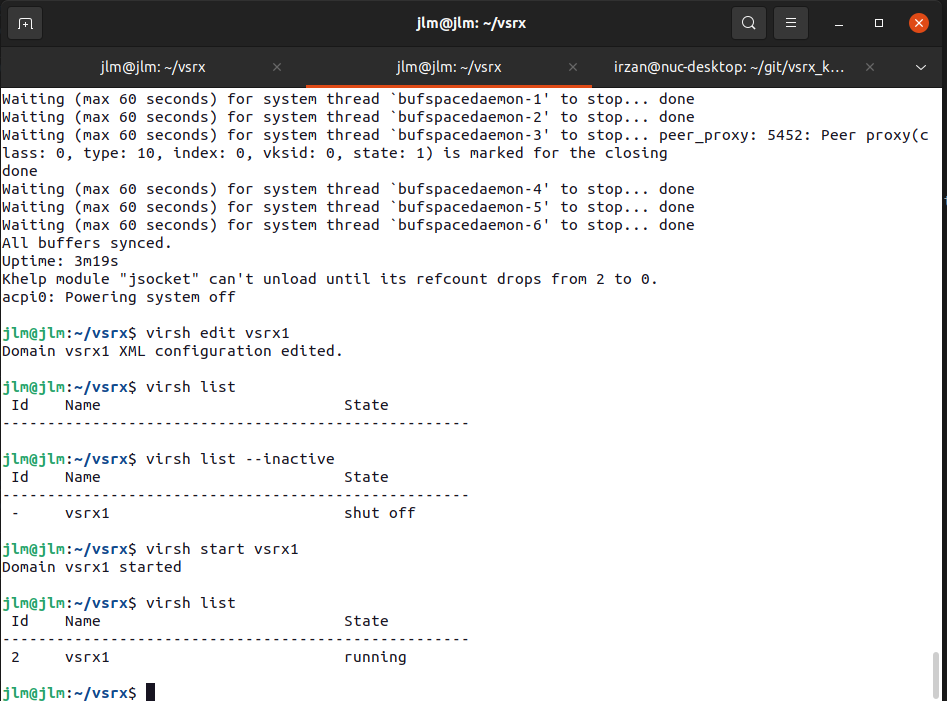

# How install vsrx on KVM with SRIOV

This document provide information on how install vsrx on KVM with SRIOV

Official documentation can be found [here](https://www.juniper.net/documentation/us/en/software/vsrx/vsrx-consolidated-deployment-guide/index.html)

## Setting linux host
### Enable hugepages
1. Edit file /etc/defaut/grub and add the following item. This will allocate 48G for hugepages on the linux host

        GRUB_CMDLINE_LINUX_DEFAULT="default_hugepagesz=1G hugepagesz=1G hugepages=48 iommu=pt intel_iommu=on isolcpus=4-55 transparent_hugepage=never"
2. re-run grub-mkconfig to recreate grub.cfg

        sudo grub-mkconfig /boot/grub/grub.cfg

3. Reboot server
4. login into server and verify that hugepages has been allocated

        cat /proc/meminfo | grep Huge

        

### setting virtual function on the network interface
1. verify that NIC that support SRIOV is installed on the server
2. do the following command to verify that i40e module has been loaded

        lsmod | grep i40e

3. if i40e module is not loaded, then load it using the following command

        sudo modprobe i40e

4. to verify that network interface card is properly loaded, do the following command

        lspci | grep Ether

### setting Virtual function on the network interface.
let say that the vSRX will be connected to interface enp130s0f0 dan enp130s0f1 with SRIOV

vsrx | host
--|--
ge-0/0/0 | enp130s0f0
ge-0/0/1 | enp130s0f1

the do the following to enable VF (virtual function) on interface enp130s0f0 and enp130s0f1
1. Verify that VF is not enabled on interface enp130s0f0 and enp130s0f1. numvfs value must be 0

        sudo cat /sys/class/net/enp130s0f0/device/sriov_numvfs
        sudo cat /sys/class/net/enp130s0f1/device/sriov_numvfs

2. enable VF on on interface enp130s0f0 and enp130s0f1. to add  1x VF on these interfaces, do the following

        echo 1 | sudo tee  /sys/class/net/enp130s0f0/device/sriov_numvfs
        echo 1 | sudo tee  /sys/class/net/enp130s0f1/device/sriov_numvfs

3. To verify that VF has been add, do the following
        
        lspci | grep Ether

4. 82:02.0 is the PCI address of VF 1 on interface enp130s0f0, and 82:06.0 is the PCI address of VF 1 on interface enp130s0f1

### Install vSRX3.0 on the kvm 
1. Get the vsrx3.0 disk image
2. copy it to a new file, let say vsrx1.qcow2
3. create bridge interface, for example br0, or you can use the existing one. This bridge interface will be used for connection to management interface (fxp0) of vsrx

        sudo ip link add dev br0 type bridge
        sudo ip link set dev br0 up
        sudo ip addr add dev br0 192.168.1.2/24

![br0]](br0.png)
3. Run the following script to start vsrx

        
        virsh list --inactive
        virt-install --name vsrx1  \
                --memory 32768,hugepages=yes --memorybacking hugepages=yes --vcpus=17 --arch=x86_64  \
                --cpu SandyBridge,+pbe,+tm2,+est,+vmx,+osxsave,+smx,+ss,+ds,+vme,+dtes64,+monitor,+ht,+dca,+pcid,+tm,+pdcm,+pdpe1gb,+ds_cpl,+xtpr,+acpi,-invtsc \
                --os-type linux --os-variant generic \
                --disk vsrx1.qcow2,device=disk,size=16,bus=ide,format=qcow2 \
                --network bridge=br0,model=e1000,target=fxp0 \
                --network bridge=br0,model=e1000,target=ge_0_0_0 \
                --network bridge=br0,model=e1000,target=ge_0_0_1 \
                --console pty,target_type=serial --noautoconsole --hvm --accelerate --graphics vnc,listen=0.0.0.0 \
                --virt-type=kvm --boot hd

![vsrx_install]]](vsrx_install.png)

4. to verify that vsrx is running do the following

        virsh list 

![vsrx_run]]](vsrx_run.png)

5. To access console of vsrx, use the following command

        virsh console vsrx1

6. Shutdown vsrx to change interface attachment to VF on interface enp130s0f0 and enp130s0f1
7. Verify that vsrx is off

        virsh list

8. edit configuration of vsrx vm, and look for entry <interface>. There will be three entries, the first one is for interface fxp0 (just leave it as it is). We are going to change the 2nd (for interface ge-0/0/0) and 3rd (for interface (ge-0/0/1)

        virsh edit vsrx1

9. For example, for interface ge-0/0/0, change the following entries

        <interface type='bridge'>
                <mac address='52:54:00:2a:7c:cf'/>
                <source bridge='br0'/>
                <target dev='ge_0_0_0'/>
                <model type='e1000'/>
                <address type='pci' domain='0x0000' bus='0x00' slot='0x04' function='0x0'/>
        </interface>

  to

        <interface  type="hostdev" managed="yes">
                <mac address='52:54:00:2a:7c:cf'/>
                <driver name="vfio"/>
                <target dev='ge_0_0_0'/>
                <model type='e1000'/>
                <source> 
                        <address type="pci" domain="0x0000" bus="0x82" slot="0x02" function="0x0"/>
                </source> 
        </interface>

  remember for entry <address type="pci" domain="0x0000" bus="0x82" slot="0x02" function="0x0"/>, the bus, slot and function must match the output of lspci

10. for interface ge-0/0/1, change the following entries

        <interface type='bridge'>
                <mac address='52:54:00:73:6c:29'/>
                <source bridge='br0'/>
                <target dev='ge_0_0_0'/>
                <model type='e1000'/>
                <address type='pci' domain='0x0000' bus='0x00' slot='0x05' function='0x0'/>
        </interface>
   
   to 
        
        <interface  type="hostdev" managed="yes">
                <mac address='52:54:00:73:6c:29'/>
                <driver name="vfio"/>
                <target dev='ge_0_0_1'/>
                <model type='e1000'/>
                <source> 
                        <address type="pci" domain="0x0000" bus="0x82" slot="0x06" function="0x0"/>
                </source> 
        </interface>

11. Save the configuration and quit the virsh editor
12. Start the vsrx

        virsh start vsrx1

13. Now vsrx should be connected to interface on linux host using SRIOV, and you can start the vrsx configuration
