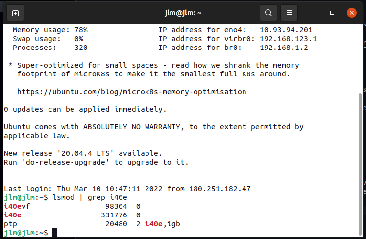

# How install vsrx on KVM with SRIOV

This document provide information on how install vsrx on KVM with SRIOV

Official documentation can be found [here](https://www.juniper.net/documentation/us/en/software/vsrx/vsrx-consolidated-deployment-guide/index.html)

## Setting linux host
### Enable hugepages
1. Edit file /etc/defaut/grub and add the following item. This will allocate 48G for hugepages on the linux host

        GRUB_CMDLINE_LINUX_DEFAULT="default_hugepagesz=1G hugepagesz=1G hugepages=48 iommu=pt intel_iommu=on isolcpus=4-55 transparent_hugepage=never"
2. re-run grub-mkconfig to recreate grub.cfg

        sudo grub-mkconfig /boot/grub/grub.cfg

3. Reboot server

### setting virtual function on the network interface
1. verify that NIC that support SRIOV is installed on the server
2. do the following command to verify that i40e module has been load

        lsmod | grep i40e
        
